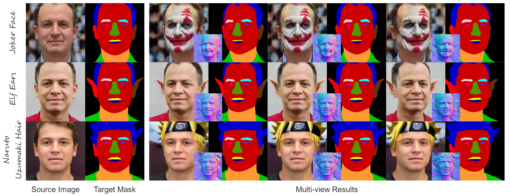
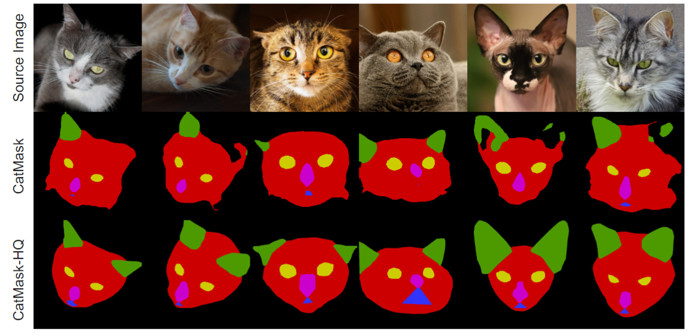

<!-- ### <div align="center"> MaTe3D: Mask-guided Text-based 3D-aware Portrait Editing <div>  -->
# MaTe3D: Mask-guided Text-based 3D-aware Portrait Editing
<div align="center">

<a href='https://montaellis.github.io/mate-3d/'></a> &ensp;
<a href='https://arxiv.org/abs/2312.06947'></a> &ensp;
<a href='https://youtu.be/zMNYan1mIds'></a> &ensp;
<a href='https://huggingface.co/datasets/Ellis/CatMaskHQ'></a> &ensp;
<a href='https://huggingface.co/Ellis/MaTe3D'></a> &ensp;
</div>


[Kangneng Zhou](https://montaellis.github.io/), [Daiheng Gao](https://tomguluson92.github.io/), [Xuan Wang](https://xuanwangvc.github.io/), [Jie Zhang](https://scholar.google.com/citations?user=gBkYZeMAAAAJ), [Peng Zhang](https://scholar.google.com/citations?user=QTgxKmkAAAAJ&hl=zh-CN), [Xusen Sun](https://dblp.org/pid/308/0824.html), [Longhao Zhang](https://scholar.google.com/citations?user=qkJD6c0AAAAJ), [Shiqi Yang](https://www.shiqiyang.xyz/), [Bang Zhang](https://dblp.org/pid/11/4046.html), [Liefeng Bo](https://scholar.google.com/citations?user=FJwtMf0AAAAJ&hl=zh-CN), [Yaxing Wang](https://scholar.google.es/citations?user=6CsB8k0AAAAJ), [Yaxing Wang](https://scholar.google.es/citations?user=6CsB8k0AAAAJ), [Ming-Ming Cheng](https://mmcheng.net/cmm)





## MaTe3D

3D-aware portrait editing has a wide range of applications in multiple fields. However, current approaches are limited due that they can only perform mask-guided or text-based editing. Even by fusing the two procedures into a model, the editing quality and stability cannot be ensured. To address this limitation, we propose \textbf{MaTe3D}: mask-guided text-based 3D-aware portrait editing. In this framework, first, we introduce a new SDF-based 3D generator which learns local and global representations with proposed SDF and density consistency losses. This enhances masked-based editing in local areas; second, we present a novel distillation strategy: Conditional Distillation on Geometry and Texture (CDGT). Compared to exiting distillation strategies, it mitigates visual ambiguity and avoids mismatch between texture and geometry, thereby producing stable texture and convincing geometry while editing. Additionally, we create the CatMask-HQ dataset, a large-scale high-resolution cat face annotation for exploration of model generalization and expansion. We perform expensive experiments on both the FFHQ and CatMask-HQ datasets to demonstrate the editing quality and stability of the proposed method. Our method faithfully generates a 3D-aware edited face image based on a modified mask and a text prompt.

## Preparation
### Environment
```bash
pip install torch torchvision
```

### Dataset
Download [CatMaskHQ](https://huggingface.co/datasets/Ellis/CatMaskHQ) dataset.

To expand the scope beyond human face and explore the model generalization and expansion, we design the CatMask-HQ dataset with the following representative features:

**Specialization**:  CatMask-HQ is specifically designed for cat faces, including precise annotations for six facial parts (background, skin, ears, eyes, nose, and mouth) relevant to feline features.

**High-Quality Annotations**: The dataset benefits from manual annotations by $50$ annotators and undergoes $3$ accuracy checks, ensuring high-quality labels and reducing individual differences.

**Substantial Dataset Scale**: With approximately $5,060$ high-quality real cat face images and corresponding annotations, CatMask-HQ provides ample training database for deep learning models.




### Model Weight
| Model | Data |  URL   |
|-------|------|--------|
| ControlNet-Face | FFHQ-Mask | [:link:](https://huggingface.co/Ellis/MaTe3D/tree/main/face_controlnet) |
| ControlNet-CatFace | CatMaskHQ | [:link:](https://huggingface.co/Ellis/MaTe3D/tree/main/cat_controlnet) |
| MaTe3D-Face | FFHQ-Mask | [:link:](https://huggingface.co/Ellis/MaTe3D/tree/main/pretrained-g) |
| MaTe3D-CatFace | CatMaskHQ | [:link:](https://huggingface.co/Ellis/MaTe3D/tree/main/pretrained-g) |

## Inference

### ControNet
1. Face
```
cd controlnet
python infer.py
```

2. Cat
```
cd controlnet
python infer_cat.py
```

### Generator

1. Face
```
cd mate3d-generator
python infer_face.py
```


2. Cat Face
```
cd mate3d-generator-cat
python infer_cat.py
```
### Editing
1. Old Editing

```
python gen_video_proj_withseg_edit_yaw_1.py --network_aux /openbayes/input/input0/results/face/edit_output/0001-old/mate3d-mask-face.pkl/20_fintuned_generator.pkl   --latent /openbayes/home/mate3d-generator/data/seed0001.npz --latent_aux /openbayes/input/input0/results/face/edit_output/0001-old/mate3d-mask-face.pkl/20_projected_w.npz --output videos/0001.mp4
```

2. Hair Editing

```
python gen_video_proj_withseg_edit_yaw_362.py --network_aux /openbayes/input/input0/results/face/edit_output/0362-hair/mate3d-mask-face.pkl/40_fintuned_generator.pkl   --latent /openbayes/home/mate3d-generator/data/seed0362.npz --latent_aux /openbayes/input/input0/results/face/edit_output/0362-hair/mate3d-mask-face.pkl/40_projected_w.npz --output videos/0362.mp4
```


## Citation	

```
@article{zhou2023mate3d,
  title     = {MaTe3D: Mask-guided Text-based 3D-aware Portrait Editing},
  author    = {Kangneng Zhou, Daiheng Gao, Xuan Wang, Jie Zhang, Peng Zhang, Xusen Sun, Longhao Zhang, Shiqi Yang, Bang Zhang, Liefeng Bo, Yaxing Wang, Ming-Ming Cheng},
  journal   = {arXiv preprint arXiv:2312.06947},
  website   = {https://montaellis.github.io/mate-3d/},
  year      = {2023}}
```
